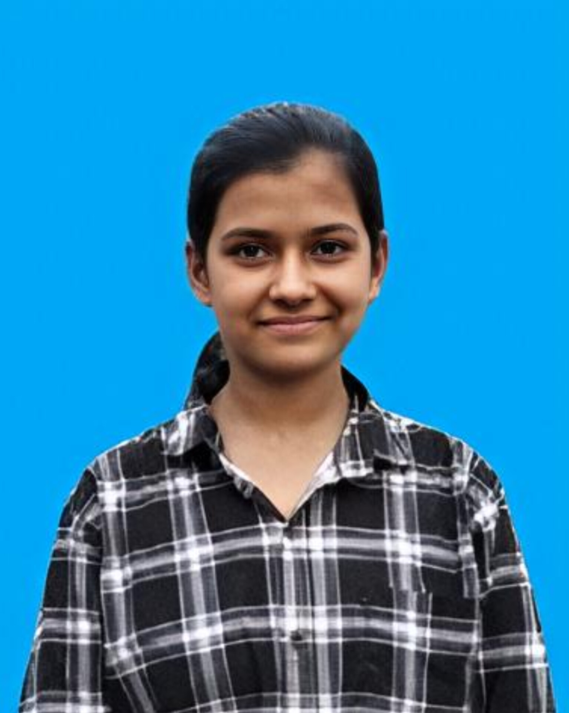

# 🌐 Personal Portfolio Website

A modern, responsive personal portfolio website built using **HTML5** and **CSS3**. This portfolio showcases personal information, skills, projects, and contact details with a clean dark-themed user interface.

## 📌 Features

- Responsive design for desktop and mobile devices
- Fixed navigation bar with smooth scrolling
- Hero section with profile image
- About Me section
- Skills showcase
- Projects section with GitHub links
- Contact section with email and social media links
- Modern dark theme with hover animations

## 🛠️ Technologies Used

- HTML5
- CSS3
- Google Fonts (Poppins)
- Flexbox
- CSS Grid
- Media Queries

## 📂 Project Structure

```
Portfolio/
│
├── index.html
├── photo.jpeg
└── README.md
```

## 🚀 Getting Started

### 1. Clone the Repository

```bash
git clone https://github.com/your-username/portfolio.git
```

### 2. Open the Project

Navigate to the project folder and open `index.html` in your preferred web browser.

Or use **Live Server** in Visual Studio Code for the best experience.

## 📸 Profile Image

Replace the image path inside the HTML file:

```html

```

> **Note:** Avoid using local file paths like:

```text
C:\Users\snchy\OneDrive\Desktop\Project\photo.jpeg
```

Instead, keep the image in your project folder and use a relative path:

```html

```

## ✏️ Customization

You can easily personalize the portfolio by updating:

- Name
- Profile image
- About section
- Skills
- Projects
- GitHub link
- LinkedIn link
- Email address
- Theme colors in the CSS variables

Example:

```css
:root {
    --bg-color: #121214;
    --surface-color: #1a1a1e;
    --accent-color: #2A69AC;
}
```

## 📱 Responsive Design

The website includes media queries for smaller screen sizes and adjusts:

- Hero layout
- Profile image size
- Navigation menu
- Section spacing

## 🎨 Design Highlights

- Dark UI
- Smooth scrolling navigation
- Hover animations
- Circular profile image
- Card-based layout
- Modern typography using Poppins font

## 📧 Contact

**Kalashree**

Email: snchy71@gmail.com

GitHub: https://github.com/username

LinkedIn: https://linkedin.com

## 📄 License

This project is open source and available under the **MIT License**.

## 🙏 Acknowledgements

- Google Fonts
- HTML5
- CSS3

---

Made with ❤️ by **Kalashree**
